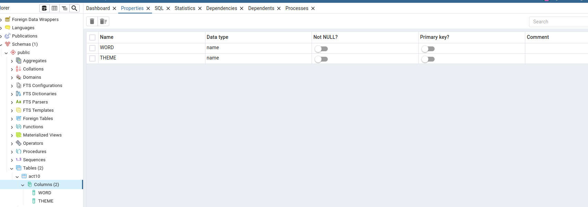

<h1>Activitat 10 Postgres</h1>
<h4>Creació i insercio dels registres a la taula</h4>

Per començar he creat una taula buida a postgres de nom act10 en la que hi ha 2 columnes de name una de NOM i una de THEME.

