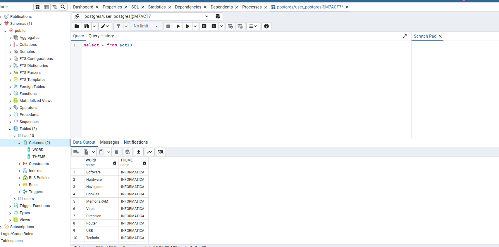
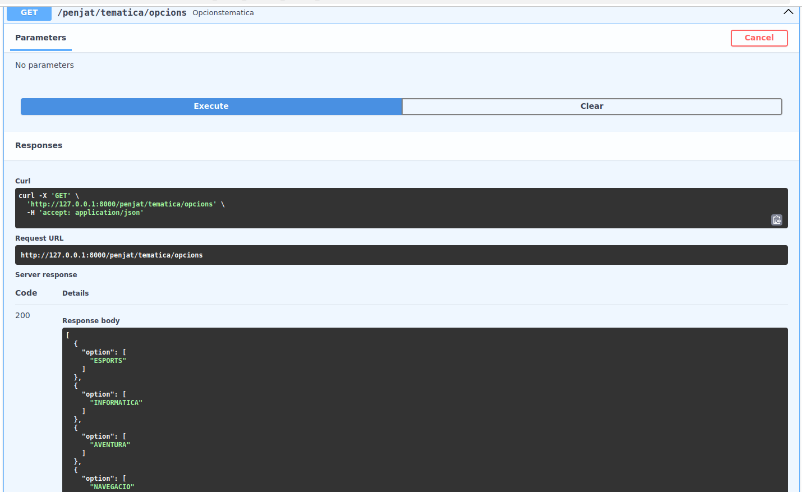
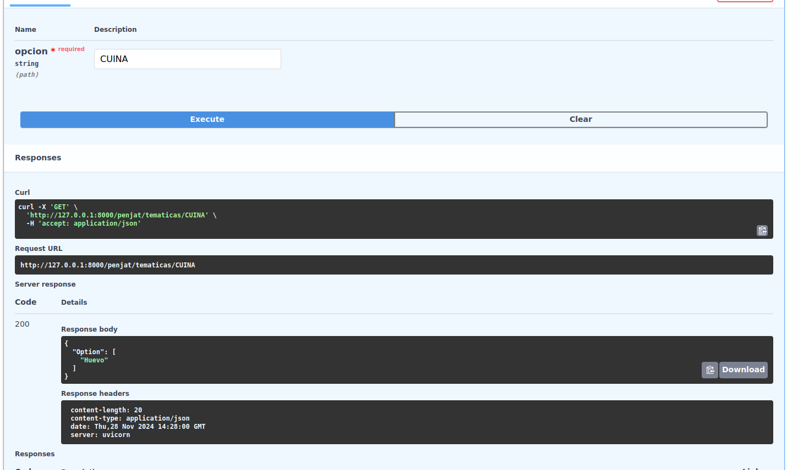

<h1>Activitat 10 Postgres</h1>
<h4>Creació i insercio dels registres a la taula</h4>

Per començar he creat una taula buida a postgres de nom act10 en la que hi ha 2 columnes de name una de NOM i una de THEME.

Despres d'executar el script csvToPostgres.py la taula ja s'ha emplenat completament i correctament amb totes les dades de forma correcta. Captura a continuació.

<h4>Documentacio dels metodes fastAPI<h4>

El primer metode de la API es el opcions tematica que el que fa es retornarte totes les opcions de tematica uniques dispoibles. La sortida de dades esta serialitzada amb el readOptions schema i amb el readOptions fem la consulta SQL a la taula postgres i la retornem

El segon metode de la API es el getWord que et retorna una paraula aleatoria de una tematica que be donada com a path parametre de la API. Al igual que l'altre metode les dades es serialitzen amb el WordSchema i la consulta SQL es fa amb el readWord

