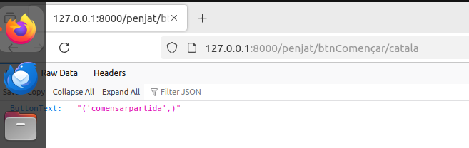
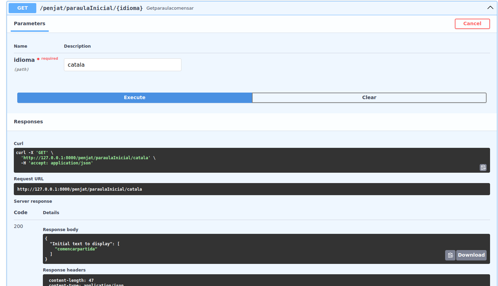
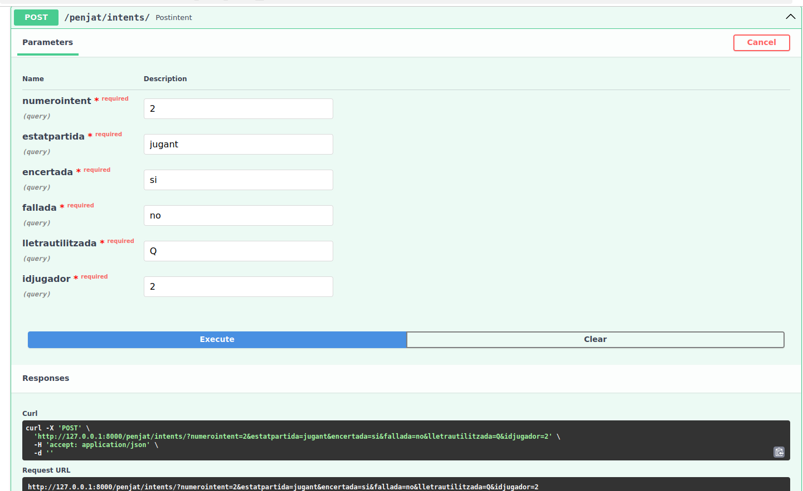
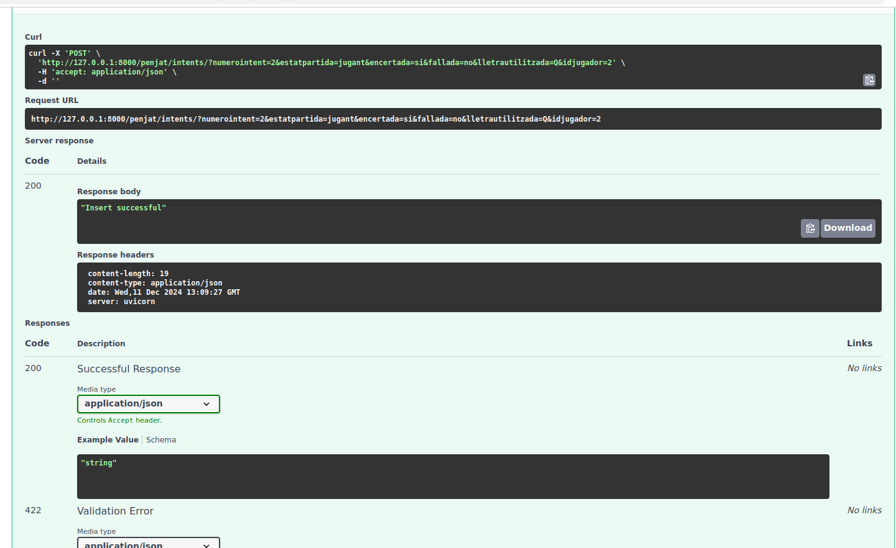
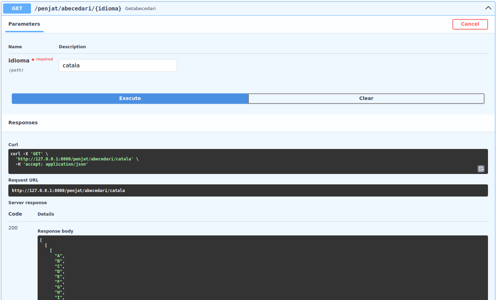
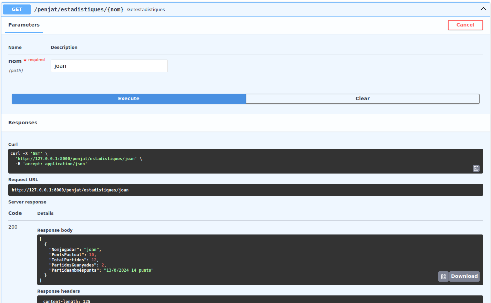
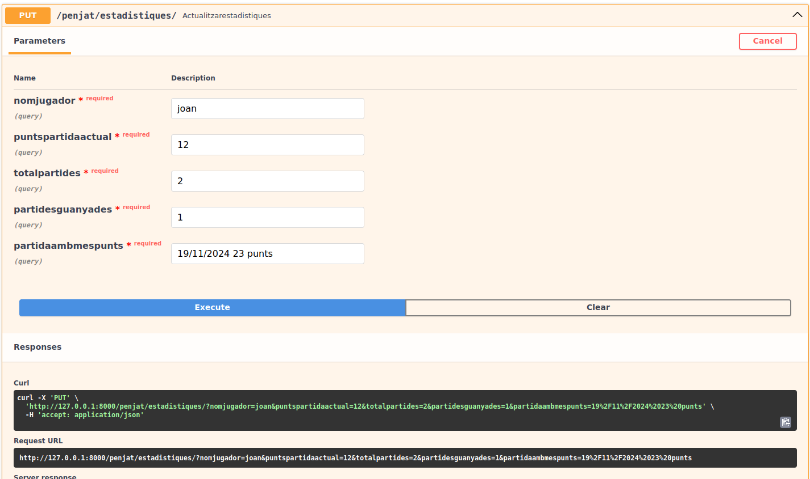

<h1>Documentacio Activitat 11</h1>
<h2>Estructura de la base de dades</h2>

Aquesta es la estructura que farem servir a la base de dades

En color BLAU estan les claus primaries i en color VERMELL estan les claus foraneas

<h2>Documentació dels endpoints</h2>
<h4>getBtnComensar</h4>

Aquest endpoint el que fa és reotrnanrnos el text del boto de comencçar en funcio de l'idioma que nosaltres li especifiquem com a parametre del path

<h4>getParaulaComensar</h4>

Aquest endpoint el que fa és reotrnanrnos el text inicial en el lloc de la paraula en funcio de l'idioma que nosaltres li especifiquem com a parametre del path

<h4>postIntent</h4>

Aquest endpoint el que fa és registrar un intent de jugada en la base de dades agafant diferents camps com a parametres per a poder registrar l'intent

<h4>getAbecedari</h4>

Aquest endpoint el que fa és retornar un abecedari en format llista en funció de l'idioma especificat en el path parametre

<h4>getEstadistiques</h4>

Aquest endpoint el que fa és retornar les estadistiques de un jugador en funció del seu nom que es passa com a parametre del path

<h4>actualitzarEstadistiques</h4>

Aquest endpoint el que fa és actualitzar les estadistiques de un jugador donat el seu nom i tots els camps

