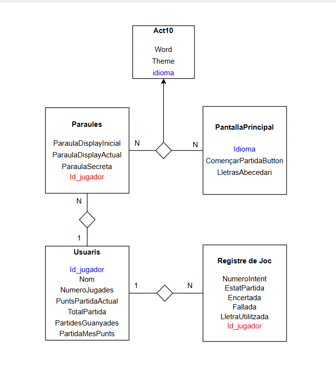

<h1>Documentacio Activitat 11</h1>
<h2>Estructura de la base de dades</h2>

Aquesta es la estructura que farem servir a la base de dades

En color BLAU estan les claus primaries i en color VERMELL estan les claus foraneas
