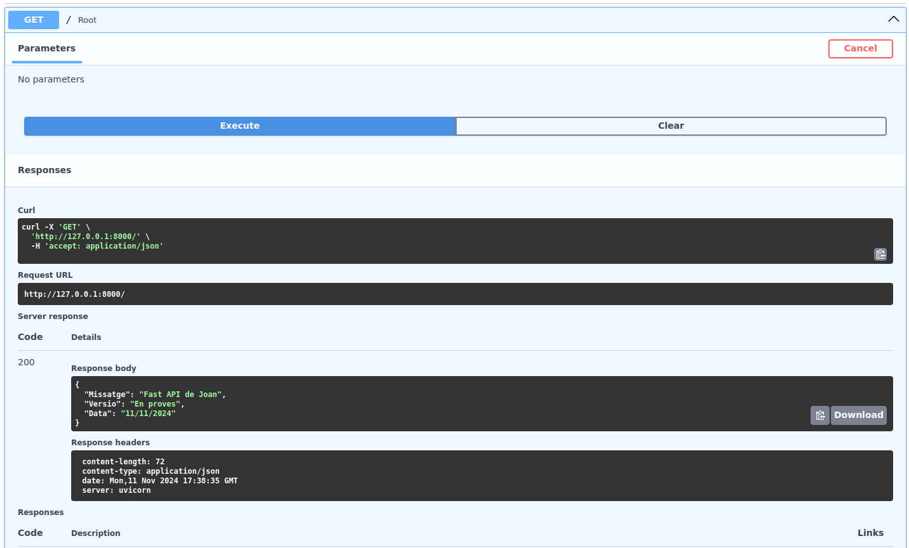
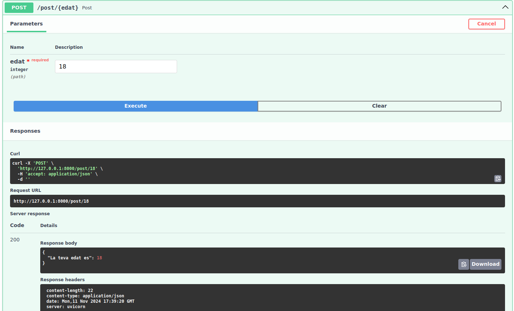

<h1>Documentacio i captures de la activitat</h1>
<h2>Swagger</h2>
<h3>GET /root</h3>

Metode GET simple que retorna un JSON amb un missatge i una data, es diu /root

<h3>POST /{edat}</h3>

Metode POST simple que tu entres una edat en la url i et retorna La teva edat es i el valor corresponent que hagi entrat el usuari

<h2>POSTMAN</h2>
<h3>GET /root</h3>

Metode GET simple que retorna un JSON amb un missatge i una data, es diu /root

<h3>POST /{edat}</h3>

Metode POST simple que tu entres una edat en la url i et retorna La teva edat es i el valor corresponent que hagi entrat el usuari

