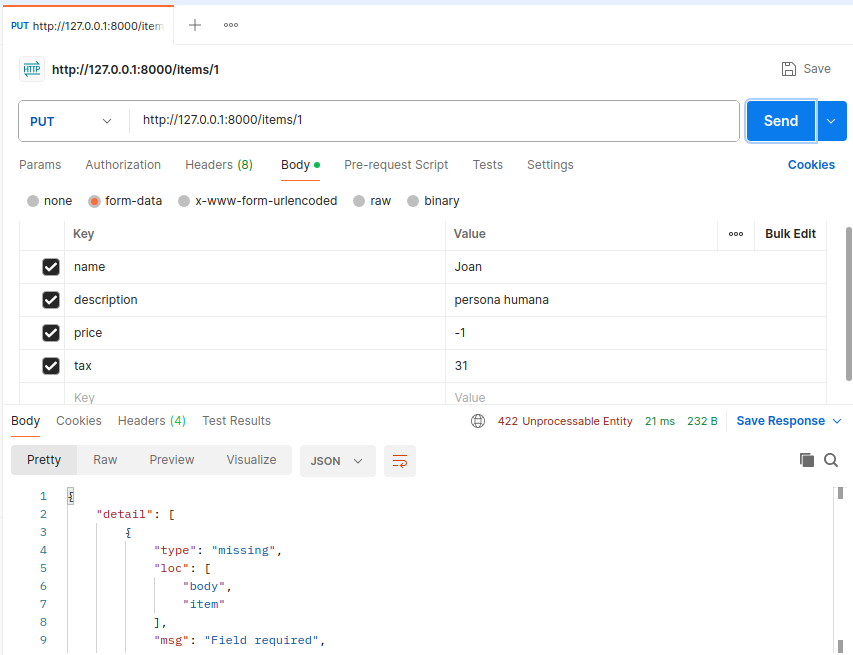
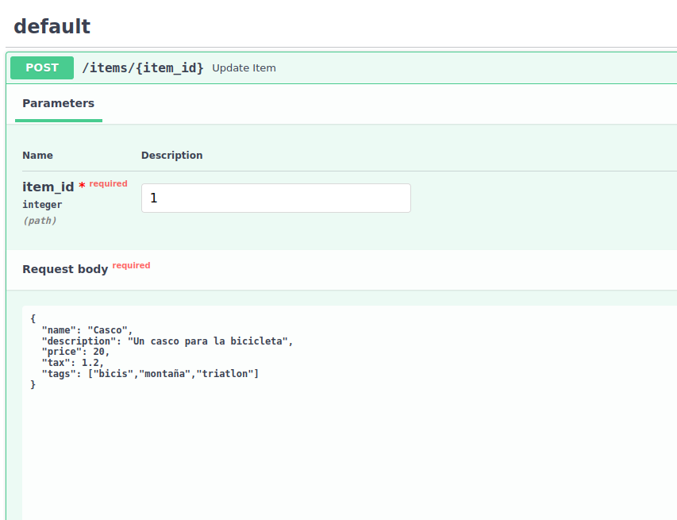
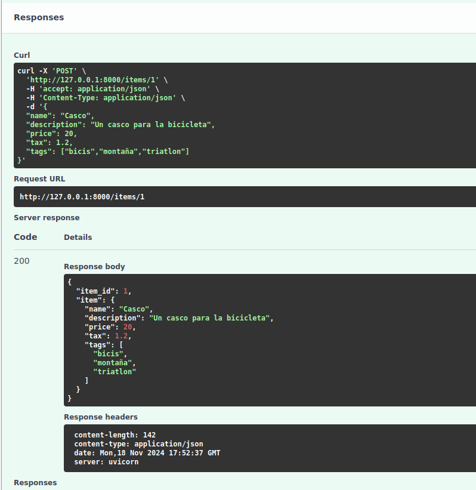

<h1>Documentació Activitat 9</h1>

<h2>Body field</h2>

<h4>El Field es una propietat que tenen els camps del Base Model.
Amb el Base Model es pot definir un model d'objecte en el que hi ha uns camps especifics que són d'un tipus de dades determinat. El Body Field ens serveix per a afegir informació adicional als camps del nostre Base Model, Afegint-hi constraints, descripcions,valors per defecre(default) o propietats com el max_length o el gt que es greater than 0. Serveix per a fer que el nostre base model sigui el més paregut possible a la estructura de la nostra base de dades.</h4>

--Exemple de codi aplicant algunes caracteristiques del Body Field

from typing import Annotated

from fastapi import Body, FastAPI
from pydantic import BaseModel, Field

app = FastAPI()

class Item(BaseModel):
    name: str
    description: str | None = Field(
        default=None, title="The description of the item", max_length=300
    )
    price: float = Field(gt=0, description="The price must be greater than zero")
    tax: float | None = None

@app.put("/items/{item_id}")
async def update_item(item_id: int, item: Annotated[Item, Body(embed=True)]):
    results = {"item_id": item_id, "item": item}
    return results

<h4>En el codi podem veure les propietats que he mencionat anteriorment com el gt el title o la description</h4>
<h4>Captures del Postman del codi anterior</h4>
</img>

En aquesta captura veiem que el codi falla per 2 motius, el primer es perque no hi ha cap registre amb el ID 1 i el segon motiu es perquè el price hem posat -1 i el field tenia una condició que el price havia de ser més gran que 0 llavors el programa peta. Es un comportament similar a les constraints de les bases de dades que ens va enseñar el Jordi Quesada.

<h2>Body-Nested Models</h2>
<h4>El body nested model significa que a dins de un atribut del nostre base model podem tenir un model de dades complex, per exemple un Atribut categories que es una llista de les categories a la que pertany un producte</h4>
<h4>Hi han varis tipus de models de dades que poden estar com a tipus d'un atribut del base model</h4>
<h4>-List</h4>
<h4>-Set</h4>
<h4>-Un altre base Model</h4>
<h4>-Submodel</h4>
<h4>-HTTPURL</h4>
<h4>Hi han molts més tipus de models que poden ser com un atribut fins i tot un base model com a un tipus de dades</h4>
<h4>Ara probarem el seguent codi per veure com fer un POST on un dels camps del base model (Tags) es del tipus List ja que pot tenir varios tags</h4>

from fastapi import FastAPI
from pydantic import BaseModel

app = FastAPI()

class Item(BaseModel):
    name: str
    description: str | None = None
    price: float
    tax: float | None = None
    tags: list = []

@app.put("/items/{item_id}")
async def update_item(item_id: int, item: Item):
    results = {"item_id": item_id, "item": item}
    return results

Captura d'execucio del codi en el Swagger

Segona captura

<h4>Podem veure l'execucio del codi com fem un post del nostre item com en els tags en comptes de ser un typus de dada normal es una llista de Strings. Per als altres typus de dades mencionats anteriorment seria el mateix funcionament sent el nested model el mes complex d'aplicar degut a la complexa estructura de dades que tindriem</h4>